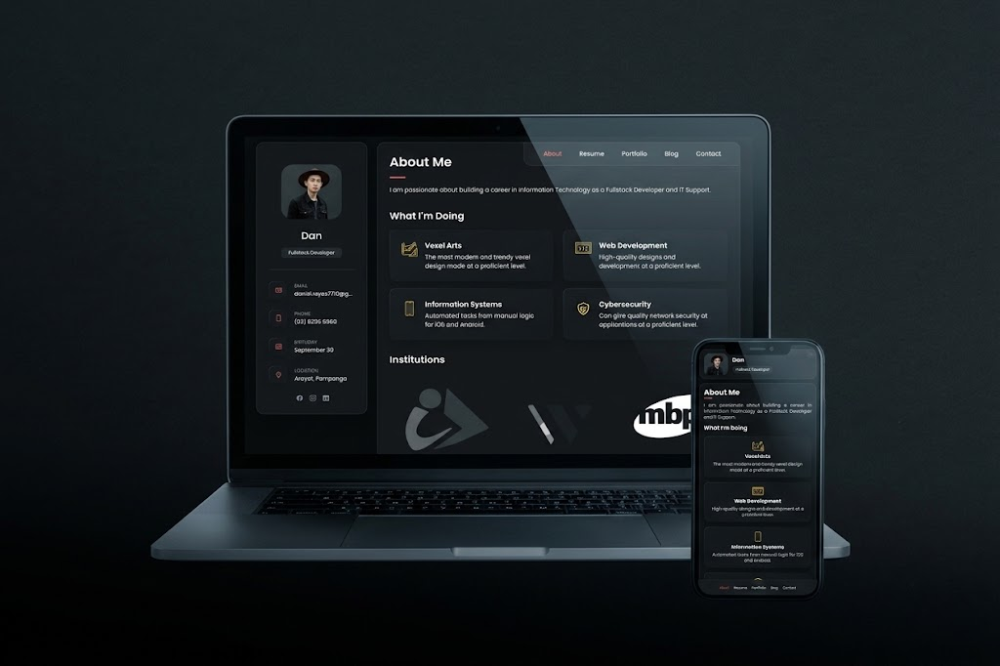

<div align="center">
  <h1>my.portfolio</h1>
  <p></p>
  <h3>My personal single-page portfolio site, built plain and shipped minified.</h3>
  <p>HTML / CSS / JavaScript / pnpm build pipeline / GitHub Actions = GitHub Pages</p>
  <br>
  <p>
    <a href="#-purpose">Purpose</a> //
    <a href="#-why-i-built-this">Why</a> //
    <a href="#-tech-stack">Tech Stack</a> //
    <a href="#-development-steps">Development</a> //
    <a href="#-deployment-steps">Deployment</a>
  </p>
  <br>
  <p>
    <a href="https://github.com/thanyeal/my.portfolio/actions/workflows/deploy.yml"></a>
    
    
    
    
    
  </p>
</div>

## Welcome stalker!

Thanks for stopping by! This is the source code behind my personal portfolio site - a single page that holds my introduction, resume, projects, and a way to reach me. Feel free to poke around the code, fork it, or use it as a reference for your own site.

<a id="-purpose"></a>

## What's the purpose of this?

This hosts the full source of my portfolio website - the one deployed live via GitHub Pages. It contains:

- The static markup, styles, and scripts for the site (`index.html`, `assets/css`, `assets/js`, `assets/images`)
- A `pnpm`-based build pipeline that minifies HTML, CSS, and JS before deployment
- A GitHub Actions workflow that builds and publishes the site automatically on every push to `main`

<a id="-why-i-built-this"></a>

## Why did I build this?

I wanted a personal site that:

- Represents my work (design, dev, cybersecurity) in one place - About, Resume, Portfolio, Blog, Contact
- Doesn't depend on a framework or CMS - just HTML/CSS/JS, easy to reason about and easy to keep alive long-term. (It's also a showcase of how I develope a website in traditional way, no vibe code or what 😅)
- Loads fast and stays lightweight, so I set up a proper build step to minify assets before they ship, instead of serving raw source files straight to visitors
- Deploys itself - push to `main`, and the live site updates without any manual steps
<div align="center">
<a id="-tech-stack"></a>

## Simple Tech Stack

<p>
   
</p>

| Layer | Tool |
|---|---|
| **Markup / Styling / Behavior** | HTML5 / CSS3 / Vanilla JavaScript |
| **Icons** | [Ionicons](https://ionic.io/ionicons) |
| **Fonts** | [Google Fonts - Poppins](https://fonts.google.com/specimen/Poppins) |
| **Package manager** | [pnpm](https://pnpm.io) |
| **Minification** | [html-minifier-terser](https://github.com/terser/html-minifier-terser) / [clean-css-cli](https://github.com/clean-css/clean-css-cli) / [terser](https://github.com/terser/terser) |
| **CI/CD** | [GitHub Actions](https://github.com/features/actions) |
| **Hosting** | [GitHub Pages](https://pages.github.com/) |

</div>

<a id="-development-steps"></a>


## Development steps

1. **Clone the repo**

   ```bash
   git clone https://github.com/thanyeal/my.portfolio.git
   cd my.portfolio
   ```

2. **Install dependencies**

   ```bash
   pnpm install
   ```

3. **Edit source files** - all real editing happens in the root-level source, not in `dist/`:
   - `index.html` - page content and structure
   - `assets/css/style.css` - styling
   - `assets/js/script.js` - behavior (nav, filtering, form validation)
   - `assets/images/` - images used across the site

4. **Build the minified output locally** to preview exactly what gets deployed:

   ```bash
   pnpm build
   ```

   This runs `scripts/build.js` to scaffold `dist/` and copy images, then minifies HTML, CSS, and JS into `dist/`.

5. **Preview the build**

   ```bash
   npx serve dist
   ```

   Open the printed local URL and check that every section, image, and script works as expected.

> [!IMPORTANT]
> `dist/` is git-ignored. It's generated fresh on every build - locally for >previewing, and in CI for deployment. Never hand-edit files inside `dist/`.

<a id="-deployment-steps"></a>

## Deployment steps

Deployment is fully automated - you shouldn't need to do this manually (unless you want your brain to explode, jk.), but here's what happens under the hood:

1. **Push to `main`** - any commit pushed to `main` triggers the workflow in `.github/workflows/deploy.yml`.
2. **GitHub Actions runs the pipeline**:
   - Checks out the repo
   - Sets up `pnpm` and Node
   - Installs dependencies with `pnpm install --frozen-lockfile`
   - Runs `pnpm build` to produce the minified `dist/`
   - Uploads `dist/` as a Pages artifact and deploys it
3. **GitHub Pages serves the artifact** - configured under **Settings = Pages = Source: GitHub Actions**, so Pages always serves the *built* output, never the raw repo files.
4. **Verify** - check the **Actions** tab for a green run, then visit the live site and confirm the deployed HTML/CSS/JS is minified (view-source to double check).

To trigger a deploy manually without a new commit, use the **Run workflow** button under the Actions tab (`workflow_dispatch` is enabled).

## 🙌 Outro

That's the whole setup - simple site, simple pipeline, automated deploy. If you spot something off or have suggestions, feel free to open an issue or reach out through the contact info on the site itself. Thanks for reading this far!

<div align="center">
  <sub>Built and maintained by Dan 💫</sub>
</div>
